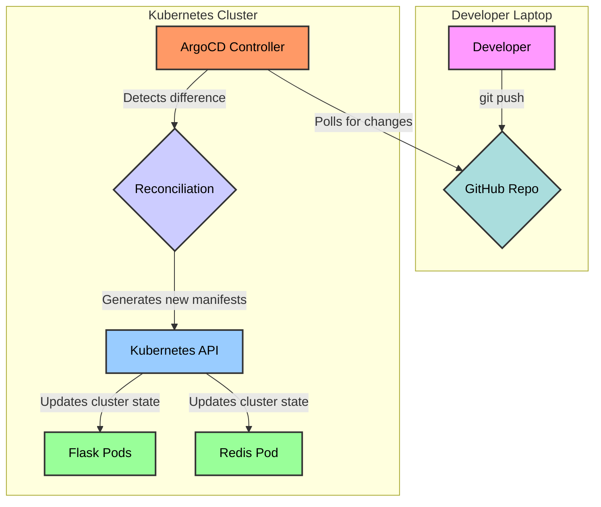

# GitOps in Action: A Self-Healing Flask & Redis Application with ArgoCD

This project demonstrates a modern GitOps workflow for deploying and managing a 2-tier web application on Kubernetes. Instead of manually applying changes to the cluster, we use ArgoCD to automatically synchronize the cluster's state with a GitHub repository, which acts as the "single source of truth."



## What Does This Project Do?

This repository contains:
1.  A simple **Python Flask application** that connects to a **Redis** database to count page visits.
2.  A **Dockerfile** to containerize the application.
3.  A **Helm chart** to define and manage all the necessary Kubernetes resources (Deployments, Services, etc.) for both Flask and Redis.
4.  An **ArgoCD application manifest** that tells ArgoCD how to deploy our app.

The result is a fully automated, self-healing deployment pipeline.

---

## Why is a GitOps Workflow Impressive?

In a traditional setup, an engineer might make changes directly to a Kubernetes cluster using `kubectl`. This approach is fast but has major drawbacks:
- **It's Fragile:** What happens if the cluster goes down? Are those manual changes documented?
- **It's Risky:** Manual changes can easily lead to mistakes and outages.
- **It's Opaque:** It's hard to know who changed what and when.

**GitOps solves these problems.** By making Git the source of truth, we gain:

- **An Audit Trail:** Every change to the infrastructure is a `git commit`, so you have a complete history of who changed what, when, and why.
- **Consistency & Reliability:** The cluster *always* reflects what's in Git. This eliminates "configuration drift" where the running state no longer matches the intended state.
- **Self-Healing:** If someone makes a manual change in the cluster, ArgoCD detects it and automatically reverts it to the state defined in Git.
- **Developer-Friendly:** Developers can manage infrastructure using the same tool they use for application code: Git.

---

## How It Works: The Reconciliation Loop

1.  **The Push:** A developer makes a change to the application or its configuration (e.g., changing `replicaCount` in the Helm chart's `values.yaml`) and pushes it to the `main` branch on GitHub.
2.  **The Detection:** ArgoCD, running in the Kubernetes cluster, constantly monitors the GitHub repository. It sees that the commit hash has changed and detects a difference between the state defined in Git (the "desired state") and what's currently running in the cluster (the "actual state").
3.  **The Sync:** ArgoCD pulls the new configuration from Git and applies the changes to the cluster.
4.  **The Result:** Kubernetes takes over. If the number of replicas was increased, the Kubernetes scheduler creates new pods to match the new desired state. The application is updated with zero downtime.

This continuous cycle of checking and synchronizing is called a **reconciliation loop**.

---

## Technologies Used

- **Containerization:** Docker
- **Orchestration:** Kubernetes
- **Application:** Python (Flask) & Redis
- **Package Management:** Helm
- **GitOps Controller:** ArgoCD

## Getting Started

To run this project, you would need:
1. A running Kubernetes cluster.
2. `kubectl` installed and configured.
3. ArgoCD installed in the cluster.
4. A GitHub repository to host your code.
5. A Docker Hub (or other container registry) account.

Once the prerequisites are met, you would apply the `application.yaml` manifest to your cluster, and ArgoCD would take care of the rest!
```bash
kubectl apply -f application.yaml
```
